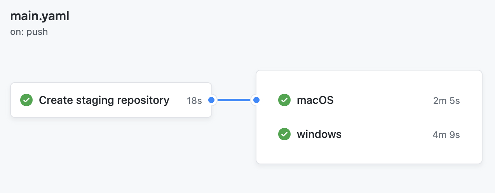

# create-nexus-staging-repository-sample

A Kotlin multiplatform sample project that uses the [create-nexus-staging-repo](https://github.com/martinbonnin/create-nexus-staging-repo) Github Action to create a Nexus repository ahead of upload and avoid split staging repositories.

🔧See it in action in this repo's [Actions](https://github.com/martinbonnin/create-nexus-staging-repo-sample/actions) 🔧



To use in your repos, first create a job using the  `create-nexus-staging-repository` action:

```yaml
jobs:
  create_staging_repository:
    runs-on: ubuntu-latest
    name: Create staging repository
    outputs:
      # connect the step output to the job output
      repository-id: ${{ steps.create.outputs.repository-id }}
    steps:
    - id: create
      uses: martinbonnin/create-nexus-staging-repo@v1
      with:
        # The username you use to connect to Sonatype's Jira
        # Do not use secrets for the username since the repository id will contain it
        # and it will not be passed across jobs :/
        username: mbonnin
        password: ${{ secrets.SONATYPE_PASSWORD }}
        # Your staging profile ID. You can get it at https://oss.sonatype.org/#stagingProfiles;$staginProfileId
        staging-profile-id: ${{ secrets.SONATYPE_STAGING_PROFILE_ID }}
        # a description to identify your repository in the UI
        description: Created by $GITHUB_WORKFLOW ($GITHUB_ACTION) for $GITHUB_REPOSITORY
```

To reuse the newly created repository id in other jobs, declare a `needs` relationship and get the output of the first job:

```yaml
  windows:
    runs-on: windows-latest
    needs: create_staging_repository

    steps:
      - name: Checkout
        uses: actions/checkout@v2
      - name: Configure JDK
        uses: actions/setup-java@v1
        with:
          java-version: 14
      - name: Publish
        run: |
          ./gradlew publishMingwX64PublicationToOss
        env:
          SONATYPE_REPOSITORY_ID: ${{ needs.create_staging_repository.outputs.repository-id }}
          SONATYPE_USERNAME: mbonnin
          SONATYPE_PASSWORD: ${{ secrets.SONATYPE_PASSWORD }}
```

You can then use `SONATYPE_REPOSITORY_ID` to declare your maven repository in your `build.gradle.kts` 🎉:

```kotlin
  repositories {
    maven {
      name = "Oss"
      setUrl {
        val repositoryId =
          System.getenv("SONATYPE_REPOSITORY_ID") ?: error("Missing env variable: SONATYPE_REPOSITORY_ID")
        "https://oss.sonatype.org/service/local/staging/deployByRepositoryId/${repositoryId}/"
      }
      credentials {
        username = System.getenv("SONATYPE_USERNAME")
        password = System.getenv("SONATYPE_PASSWORD")
      }
    }
  }
```
