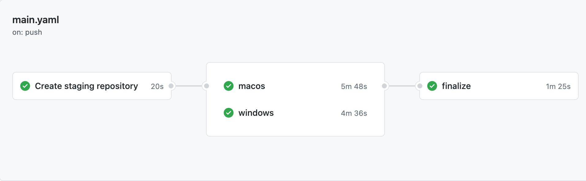
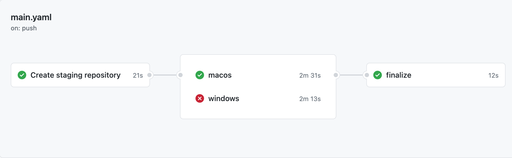

# create-nexus-staging-repository-sample

A Kotlin multiplatform sample project that uses the actions:
- [create-nexus-staging-repo](https://github.com/nexus-actions/create-nexus-staging-repo) Github Action to create a Nexus repository ahead of upload and avoid split staging repositories.
- [drop-nexus-staging-repo](https://github.com/nexus-actions/drop-nexus-staging-repo) Github Action to drop an existing Nexus staged repository, generally to discard previously uploaded artifacts after a job failure.
- [release-nexus-staging-repo](https://github.com/nexus-actions/drop-nexus-staging-repo) Github Action to close an existing Nexus staged repository, and if the sonatype process ends by closing the staged repository properly it will release the artifacts on Maven Central.

🔧 See it in action in this repo's [Actions](https://github.com/nexus-actions/create-nexus-staging-repo-sample/actions) 🔧

- On Success

- On Failure


# Make a release 

- Create a staging repo

To use in your repos, first create a job using the  `create-nexus-staging-repository` action:

```yaml
jobs:
  create_staging_repository:
    runs-on: ubuntu-latest
    name: Create staging repository
    outputs:
      # connect the step output to the job output
      repository-id: ${{ steps.create.outputs.repository-id }}
    steps:
    - id: create
      uses: nexus-actions/create-nexus-staging-repo@v1
      with:
        # The username you use to connect to Sonatype's Jira
        username: ${{ secrets.SONATYPE_USERNAME }}
        password: ${{ secrets.SONATYPE_PASSWORD }}
        # Your staging profile ID. You can get it at https://oss.sonatype.org/#stagingProfiles;$staginProfileId
        staging-profile-id: ${{ secrets.SONATYPE_STAGING_PROFILE_ID }}
        # a description to identify your repository in the UI
        description: Created by $GITHUB_WORKFLOW ($GITHUB_ACTION) for $GITHUB_REPOSITORY
```

- Publish to a staging repo

To reuse the newly created repository id in other jobs, declare a `needs` relationship and get the output of the first job:

```yaml

windows:
  runs-on: windows-latest
  needs: create_staging_repository
  steps:
    - name: Checkout
      uses: actions/checkout@v2
    - name: Configure JDK
      uses: actions/setup-java@v1
      with:
        java-version: 14
    - name: Publish
      run: |
        ./gradlew publishMingwX64PublicationToOss
      env:
        SONATYPE_REPOSITORY_ID: ${{ needs.create_staging_repository.outputs.repository-id }}
        SONATYPE_USERNAME: ${{ secrets.SONATYPE_USERNAME }}
        SONATYPE_PASSWORD: ${{ secrets.SONATYPE_PASSWORD }}
        GPG_PRIVATE_KEY: ${{ secrets.GPG_PRIVATE_KEY }}
        GPG_PRIVATE_PASSWORD: ${{ secrets.GPG_PRIVATE_PASSWORD }}
```

You can then use `SONATYPE_REPOSITORY_ID` to declare your maven repository in your `build.gradle.kts` 🎉:

```kotlin
  repositories {
    maven {
      name = "Oss"
      setUrl {
        val repositoryId =
          System.getenv("SONATYPE_REPOSITORY_ID") ?: error("Missing env variable: SONATYPE_REPOSITORY_ID")
        "https://oss.sonatype.org/service/local/staging/deployByRepositoryId/${repositoryId}/"
      }
      credentials {
        username = System.getenv("SONATYPE_USERNAME")
        password = System.getenv("SONATYPE_PASSWORD")
      }
    }
  }
```

- Drop or Release

Depending on the previous jobs you can either drop or release your staging repo:

````yaml
  finalize:
    runs-on: ubuntu-latest
    needs: [create_staging_repository, macos, windows]
    if: ${{ always() && needs.create_staging_repository.result == 'success' }}
    steps:
      - name: Discard
        if: ${{ needs.macos.result != 'success' || needs.windows.result != 'success' }}
        uses: nexus-actions/drop-nexus-staging-repo@main
        with:
          username: ${{ secrets.SONATYPE_USERNAME }}
          password: ${{ secrets.SONATYPE_PASSWORD }}
          staged_repository_id: ${{ needs.create_staging_repository.outputs.repository-id }}
      - name: Release
        if: ${{ needs.macos.result == 'success' && needs.windows.result == 'success' }}
        uses: nexus-actions/release-nexus-staging-repo@main
        with:
          username: ${{ secrets.SONATYPE_USERNAME }}
          password: ${{ secrets.SONATYPE_PASSWORD }}
          staged_repository_id: ${{ needs.create_staging_repository.outputs.repository-id }}
````

----------

# This project is brought to you by ...

- Martin Bonnin from [Apollo GraphQL](https://www.apollographql.com)
- Romain Boisselle from [Kodein Koders](https://kodein.net) 
